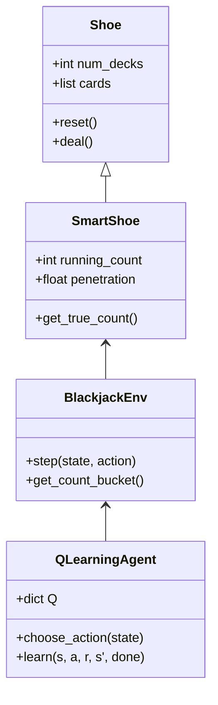

<div align="center">

# 🃏 BlackJack AI & Strategy Simulator

[](https://python.org)
[](https://jupyter.org)
[](LICENSE)
[](https://numpy.org)
[](https://pandas.pydata.org)
[](https://matplotlib.org)

<p align="center">
  
</p>

**An advanced Blackjack simulation framework featuring multiple strategies, card counting systems, AI-powered decision making with Q-Learning, and optimal bet sizing using the Kelly Criterion.**

[🚀 Getting Started](#-getting-started) •
[📊 Features](#-features) •
[🎯 Strategies](#-strategies-implemented) •
[📈 Results](#-simulation-results) •
[🧠 Q-Learning AI](#-q-learning-ai)

</div>

---

## 📋 Table of Contents

- [🎰 Overview](#-overview)
- [🚀 Getting Started](#-getting-started)
- [📊 Features](#-features)
- [🎯 Strategies Implemented](#-strategies-implemented)
  - [🔴 Never Bust Strategy](#-never-bust-strategy)
  - [🟠 Simplified Parametrized Strategy](#-simplified-parametrized-strategy)
  - [🟡 Hi-Lo Card Counting](#-hi-lo-card-counting)
  - [🟢 Basic Strategy Tables](#-basic-strategy-tables)
  - [🔵 Kelly Criterion Betting](#-kelly-criterion-betting)
  - [🟣 Q-Learning AI](#-q-learning-ai)
- [📈 Simulation Results](#-simulation-results)
- [🛠️ Technical Architecture](#️-technical-architecture)
- [📚 References](#-references)

---

## 🎰 Overview

This project is a comprehensive Blackjack research platform that simulates and analyzes various playing and betting strategies. It combines classical game theory approaches with modern reinforcement learning techniques to find optimal strategies for the casino classic.

<div align="center">

| 🎲 Feature | 📝 Description |
|:---:|:---|
| **Multi-Strategy Simulation** | Compare different playing strategies head-to-head |
| **Card Counting** | Implements Hi-Lo counting system with true count calculations |
| **AI Decision Making** | Q-Learning agent trained on 10M+ hands |
| **Bet Optimization** | Kelly Criterion for mathematically optimal bet sizing |
| **Visual Analytics** | Rich visualizations with Matplotlib, Seaborn & Plotly |

</div>

---

## 🚀 Getting Started

### Prerequisites

```bash
Python 3.8+
```

### Installation

1️⃣ **Clone the repository**
```bash
git clone https://github.com/yourusername/blackjack.git
cd blackjack
```

2️⃣ **Install dependencies**
```bash
pip install numpy pandas matplotlib seaborn plotly tqdm
```

3️⃣ **Launch Jupyter Notebook**
```bash
jupyter notebook blackjack.ipynb
```

---

## 📊 Features

<table>
<tr>
<td width="50%">

### 🎴 Realistic Game Simulation
- 6-deck shoe with 75% penetration
- Proper shuffle and "cut card" mechanics
- Accurate card value handling (Aces as 1 or 11)
- Dealer hits on soft 17 rule

</td>
<td width="50%">

### 📉 Advanced Analytics
- Win rate calculation across strategies
- Bankroll trajectory tracking
- Monte Carlo simulations (100+ runs)
- Heatmap strategy visualization

</td>
</tr>
<tr>
<td width="50%">

### 🧮 Mathematical Models
- Kelly Criterion bet optimization
- True Count calculation from Running Count
- Advantage estimation per True Count
- Variance-adjusted betting

</td>
<td width="50%">

### 🤖 Machine Learning
- Q-Learning reinforcement learning
- State-space: (hand total, dealer card, usable ace, count bucket)
- Action space: STAND, HIT, DOUBLE
- Epsilon-greedy exploration

</td>
</tr>
</table>

---

## 🎯 Strategies Implemented

### 🔴 Never Bust Strategy

> *"Stand on a specific threshold to never go over 21"*

The simplest strategy that varies the standing threshold to find the optimal point.

```
📌 KEY INSIGHT: Stand at 14 provides optimal win rate
```

| Threshold | Win Rate | Notes |
|:---------:|:--------:|:------|
| 11 | ~32% | Too aggressive - frequently busts |
| 12 | ~38% | Still too risky |
| **14** | **~42%** | ⭐ **Optimal threshold** |
| 16 | ~40% | Misses opportunities to improve hand |
| 20 | ~35% | Stands too early |

<details>
<summary>📊 Click to see the optimization chart</summary>

The notebook generates a plot showing win rate vs. strategy limit, with the optimal point highlighted at threshold 14.

</details>

---

### 🟠 Simplified Parametrized Strategy

> *"Use two thresholds: always hit below X, always stand above Y"*

A more nuanced approach that considers both player hand and dealer's up-card.

```python
def strategy_parametrized(player_hand, dealer_up_card, hit_threshold, stand_threshold):
    if player_val <= hit_threshold:
        return "HIT"
    elif player_val >= stand_threshold:
        return "STAND"
    else:
        # In between: check dealer's card
        return "HIT" if dealer_val >= 7 else "STAND"
```

<div align="center">

| Parameter | Optimal Value |
|:---------:|:-------------:|
| Hit Threshold | **11** |
| Stand Threshold | **17** |
| **Win Rate** | **~43%** |

</div>

---

### 🟡 Hi-Lo Card Counting

> *"Track the ratio of high to low cards remaining"*

Implementation of the famous Hi-Lo card counting system used by professional players.

#### Card Values

| Cards | Count Value | Reasoning |
|:-----:|:-----------:|:----------|
| 2, 3, 4, 5, 6 | **+1** | Low cards favor dealer |
| 7, 8, 9 | **0** | Neutral cards |
| 10, J, Q, K, A | **-1** | High cards favor player |

#### True Count Formula

$$\text{True Count} = \frac{\text{Running Count}}{\text{Decks Remaining}}$$

#### Bet Spread System

| True Count | Bet Multiplier | Example ($10 unit) |
|:----------:|:--------------:|:------------------:|
| ≤ 1 | 1x | $10 |
| 2 | 2x | $20 |
| 3 | 4x | $40 |
| ≥ 4 | 8x | $80 |

---

### 🟢 Basic Strategy Tables

> *"The mathematically optimal play for every situation"*

Complete implementation of Las Vegas basic strategy covering:

<div align="center">

| Table Type | Description | Example |
|:----------:|:------------|:--------|
| **Hard Totals** | No aces, or aces counting as 1 | Hard 16 vs Dealer 10 → HIT |
| **Soft Totals** | Contains an ace counting as 11 | Soft 18 vs Dealer 9 → HIT |
| **Pairs** | Two cards of same value | 8,8 vs Any → SPLIT |

</div>

#### Legend

| Symbol | Action |
|:------:|:-------|
| **H** | Hit - Take another card |
| **S** | Stand - Keep current hand |
| **D** | Double - Double bet, take one card |
| **Ds** | Double if allowed, else Stand |
| **P** | Split - Separate into two hands |

---

### 🔵 Kelly Criterion Betting

> *"Bet a fraction of your bankroll proportional to your edge"*

Mathematical framework for optimal bet sizing based on expected advantage.

#### The Kelly Formula

$$f^* = \frac{p \cdot b - q}{b} = \frac{\text{Edge}}{\text{Odds}}$$

Where:
- $f^*$ = Optimal fraction of bankroll to bet
- $p$ = Probability of winning
- $q$ = Probability of losing (1 - p)
- $b$ = Odds received on the bet

#### Implementation Parameters

```python
HOUSE_EDGE = 0.005          # 0.5% base disadvantage
EDGE_PER_TRUE_COUNT = 0.005 # +0.5% per True Count
VARIANCE = 1.33             # Standard Blackjack variance
KELLY_MULTIPLIER = 0.5      # Half Kelly (safer)
MAX_BET_CAP = 0.20          # Never bet >20% of bankroll
```

#### Advantage Calculation

$$\text{Advantage} = (\text{True Count} \times 0.5\%) - 0.5\%$$

| True Count | Player Edge | Recommended Action |
|:----------:|:-----------:|:-------------------|
| < 1.5 | Negative | Bet minimum |
| 2 | +0.25% | Slight increase |
| 3 | +0.75% | Moderate increase |
| 4+ | +1.25%+ | Maximum bet spread |

---

### 🟣 Q-Learning AI

> *"Let the machine discover optimal strategy through experience"*

A reinforcement learning agent that learns to play Blackjack through millions of simulated hands.

#### State Space

```
State = (player_sum, dealer_card, usable_ace, count_bucket)
```

| Component | Values | Description |
|:---------:|:------:|:------------|
| `player_sum` | 4-21 | Current hand total |
| `dealer_card` | 2-11 | Dealer's visible card |
| `usable_ace` | True/False | Ace that can be 11 |
| `count_bucket` | -1, 0, +1 | Cold/Neutral/Hot deck |

#### Hyperparameters

| Parameter | Value | Purpose |
|:---------:|:-----:|:--------|
| α (Learning Rate) | 0.001 | Step size for Q updates |
| γ (Discount Factor) | 1.0 | Weight of future rewards |
| ε (Exploration) | 1.0 → 0.05 | Exploration vs exploitation |
| Episodes | 10,000,000 | Training hands |

#### Q-Learning Update Rule

$$Q(s,a) \leftarrow Q(s,a) + \alpha \left[ r + \gamma \max_{a'} Q(s',a') - Q(s,a) \right]$$

---

## 📈 Simulation Results

### Monte Carlo Analysis

After training the Q-Learning agent on 10 million hands and running 100 Monte Carlo simulations:

<div align="center">

| Metric | Value |
|:------:|:-----:|
| 📊 **Average Win Rate** | ~42-44% |
| 💰 **Starting Bankroll** | $10,000 |
| 🎰 **Hands per Simulation** | 30,000 |
| 📈 **Simulations Run** | 100 |

</div>

### Key Findings

<table>
<tr>
<td align="center" width="33%">
<h3>🏆</h3>
<h4>Win Rate</h4>
<p>Consistent ~43% win rate across simulations with proper strategy</p>
</td>
<td align="center" width="33%">
<h3>📉</h3>
<h4>Variance</h4>
<p>Kelly betting reduces variance while maintaining growth</p>
</td>
<td align="center" width="33%">
<h3>🎯</h3>
<h4>Count-Dependent</h4>
<p>Q-Learning adapts strategy based on deck composition</p>
</td>
</tr>
</table>

### Strategy Heatmaps

The Q-Learning agent generates visual heatmaps showing optimal actions for:

- **Hard Totals** (Cold/Neutral/Hot counts)
- **Soft Totals** (Cold/Neutral/Hot counts)

These visualizations allow comparison with traditional basic strategy and show how optimal play shifts with deck composition.

---

## 🛠️ Technical Architecture

```
blackjack/
├── 📓 blackjack.ipynb    # Main Jupyter notebook
├── 📖 README.md          # This file
└── 🎯 Core Components:
    ├── Shoe              # Card deck management
    ├── SmartShoe         # Shoe with Hi-Lo counting
    ├── BlackjackAdvisor  # Basic strategy lookup
    ├── KellyMoneyManager # Bet sizing calculations
    ├── BlackjackEnv      # RL environment
    └── QLearningAgent    # AI decision maker
```

### Class Diagram



---

## 📚 References

<div align="center">

| 📖 Resource | 🔗 Link |
|:------------|:--------|
| Beat the Dealer (Edward O. Thorp) | [Amazon](https://www.amazon.com/Beat-Dealer-Winning-Strategy-Twenty-One/dp/0394703103) |
| The Kelly Criterion | [Wikipedia](https://en.wikipedia.org/wiki/Kelly_criterion) |
| Hi-Lo Card Counting | [Wizard of Odds](https://wizardofodds.com/games/blackjack/card-counting/high-low/) |
| Q-Learning | [Sutton & Barto RL Book](http://incompleteideas.net/book/the-book.html) |

</div>

---

<div align="center">

## 🤝 Contributing

Contributions are welcome! Feel free to:

1. 🍴 Fork the repository
2. 🔧 Create a feature branch
3. 📝 Commit your changes
4. 🚀 Push to the branch
5. 📫 Open a Pull Request

---

## 📄 License

This project is licensed under the MIT License - see the [LICENSE](LICENSE) file for details.

---

<p align="center">
  Made with ❤️ and 🃏
</p>

<p align="center">
  <strong>⚠️ Disclaimer:</strong> This project is for educational purposes only. Gambling involves risk. Please gamble responsibly.
</p>

</div>
