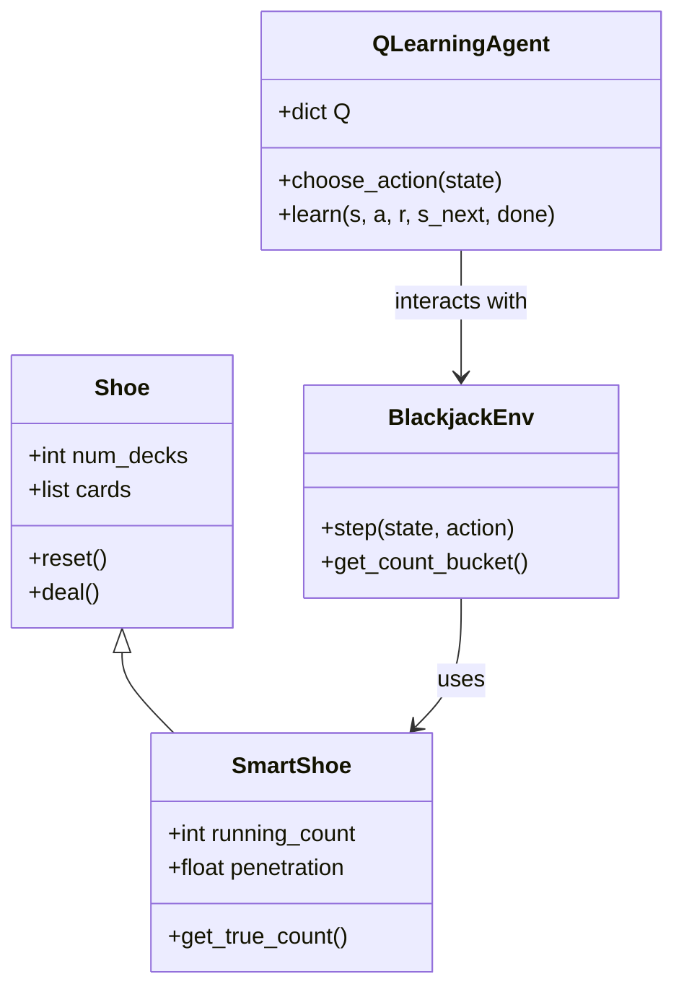

# Blackjack Strategy Simulator

[](https://python.org)
[](https://jupyter.org)
[](LICENSE)

A Blackjack simulator for comparing playing strategies, card counting, bet sizing and a tabular Q-Learning agent. Everything runs from a single Jupyter notebook.

## Contents

- [Overview](#overview)
- [Installation](#installation)
- [Simulation Rules](#simulation-rules)
- [Strategies](#strategies)
- [Results](#results)
- [Code Structure](#code-structure)
- [References](#references)
- [Contributing](#contributing)
- [License](#license)

## Overview

The project simulates Blackjack hands and measures how different decision rules perform. It covers:

| Component | Description |
|:---|:---|
| Playing strategies | Threshold rules, parametrized rules and a basic strategy lookup |
| Card counting | Hi-Lo running count and true count |
| Bet sizing | Count-based bet spread and fractional Kelly sizing |
| Reinforcement learning | Q-Learning agent trained on 10 million hands |
| Analysis | Win rate, bankroll trajectories, Monte Carlo runs and strategy heatmaps |

## Installation

Requires Python 3.8 or later.

```bash
git clone https://github.com/JosselinPerret/blackjack.git
cd blackjack
pip install numpy pandas matplotlib seaborn plotly tqdm
jupyter notebook blackjack.ipynb
```

## Simulation Rules

- 6-deck shoe, reshuffled at 75% penetration (cut card)
- Aces count as 1 or 11
- Dealer hits on soft 17
- Player actions: hit, stand, double, split

## Strategies

### Never Bust (threshold)

The player stands once the hand total reaches a fixed threshold. The notebook sweeps the threshold and records the win rate.

| Threshold | Win rate |
|:---------:|:--------:|
| 11 | ~32% |
| 12 | ~38% |
| 14 | ~42% (best) |
| 16 | ~40% |
| 20 | ~35% |

### Parametrized

Two thresholds define the rule. The player always hits at or below `hit_threshold` and always stands at or above `stand_threshold`. Between the two, the player hits if the dealer up card is worth 7 or more, and stands otherwise.

```python
def strategy_parametrized(player_hand, dealer_up_card, hit_threshold, stand_threshold):
    if player_val <= hit_threshold:
        return "HIT"
    elif player_val >= stand_threshold:
        return "STAND"
    else:
        return "HIT" if dealer_val >= 7 else "STAND"
```

Best parameters found: `hit_threshold = 11`, `stand_threshold = 17`, with a win rate of about 43%.

### Hi-Lo Card Counting

Each card seen changes the running count:

| Cards | Value |
|:-----:|:-----:|
| 2, 3, 4, 5, 6 | +1 |
| 7, 8, 9 | 0 |
| 10, J, Q, K, A | -1 |

The true count normalizes the running count by the number of decks left in the shoe:

$$\text{True Count} = \frac{\text{Running Count}}{\text{Decks Remaining}}$$

The bet is scaled from a base unit according to the true count:

| True count | Bet multiplier | Bet with a $10 unit |
|:----------:|:--------------:|:-------------------:|
| 1 or less | 1x | $10 |
| 2 | 2x | $20 |
| 3 | 4x | $40 |
| 4 or more | 8x | $80 |

### Basic Strategy

`BlackjackAdvisor` looks up the action from three tables: hard totals, soft totals and pairs. Examples: hard 16 against a dealer 10 is a hit, soft 18 against a dealer 9 is a hit, and a pair of 8s is always split.

| Code | Action |
|:----:|:-------|
| H | Hit |
| S | Stand |
| D | Double (hit if doubling is not allowed) |
| Ds | Double (stand if doubling is not allowed) |
| P | Split |

### Kelly Criterion Bet Sizing

The bet fraction is proportional to the player's edge. With a given edge and per-hand variance, the Kelly fraction is approximately:

$$f^* \approx \frac{\text{Edge}}{\text{Variance}}$$

The player's edge is modeled as a linear function of the true count:

$$\text{Edge} = 0.5\% \times \text{True Count} - 0.5\%$$

Parameters:

```python
HOUSE_EDGE = 0.005           # 0.5% base disadvantage
EDGE_PER_TRUE_COUNT = 0.005  # +0.5% per unit of true count
VARIANCE = 1.33              # per-hand variance
KELLY_MULTIPLIER = 0.5       # half Kelly
MAX_BET_CAP = 0.20           # maximum 20% of bankroll per bet
```

| True count | Edge |
|:----------:|:----:|
| 1 | 0.0% |
| 2 | +0.5% |
| 3 | +1.0% |
| 4 | +1.5% |

When the edge is zero or negative, the agent bets the table minimum.

### Q-Learning Agent

A tabular Q-Learning agent learns a policy from simulated hands.

State:

| Component | Values | Description |
|:---------:|:------:|:------------|
| `player_sum` | 4 to 21 | Current hand total |
| `dealer_card` | 2 to 11 | Dealer up card |
| `usable_ace` | True / False | Whether an ace counts as 11 |
| `count_bucket` | -1, 0, +1 | Low, neutral or high count |

Actions: stand, hit, double.

Update rule:

$$Q(s,a) \leftarrow Q(s,a) + \alpha \left[ r + \gamma \max_{a'} Q(s',a') - Q(s,a) \right]$$

Hyperparameters:

| Parameter | Value |
|:----------|:------|
| Learning rate (alpha) | 0.001 |
| Discount factor (gamma) | 1.0 |
| Exploration (epsilon) | 1.0 decayed to 0.05, epsilon-greedy |
| Training hands | 10,000,000 |

## Results

After training, the agent is evaluated with 100 Monte Carlo simulations.

| Setting | Value |
|:--------|:------|
| Starting bankroll | $10,000 |
| Hands per simulation | 30,000 |
| Simulations | 100 |
| Average win rate | about 42% to 44% |

Notes:

- The win rate is stable at about 43% across simulations.
- Kelly sizing reduces the variance of bankroll trajectories compared with a fixed bet spread.
- The learned policy depends on the count bucket. The notebook plots heatmaps of the chosen action for hard and soft totals under low, neutral and high counts, so the policy can be compared with basic strategy.

## Code Structure

```
blackjack/
├── blackjack.ipynb    # Simulation, training and analysis
└── README.md
```

Main classes in the notebook:

| Class | Role |
|:------|:-----|
| `Shoe` | Card deck management |
| `SmartShoe` | Shoe that maintains the Hi-Lo count |
| `BlackjackAdvisor` | Basic strategy lookup |
| `KellyMoneyManager` | Bet sizing |
| `BlackjackEnv` | Environment for the RL agent |
| `QLearningAgent` | Q-Learning policy |


```mermaid
classDiagram
    class Shoe {
        +int num_decks
        +list cards
        +reset()
        +deal()
    }
    class SmartShoe {
        +int running_count
        +float penetration
        +get_true_count()
    }
    class BlackjackEnv {
        +step(state, action)
        +get_count_bucket()
    }
    class QLearningAgent {
        +dict Q
        +choose_action(state)
        +learn(s, a, r, s_next, done)
    }
    Shoe <|-- SmartShoe
    BlackjackEnv --> SmartShoe : uses
    QLearningAgent --> BlackjackEnv : interacts with
```

## References

- Edward O. Thorp, *Beat the Dealer*
- [Kelly criterion](https://en.wikipedia.org/wiki/Kelly_criterion)
- [Hi-Lo counting, Wizard of Odds](https://wizardofodds.com/games/blackjack/card-counting/high-low/)
- Sutton and Barto, [*Reinforcement Learning: An Introduction*](http://incompleteideas.net/book/the-book.html)

## Contributing

Fork the repository, create a branch, and open a pull request.

## License

MIT. See [LICENSE](LICENSE).

## Disclaimer

This project is for educational purposes. Gambling involves financial risk.
